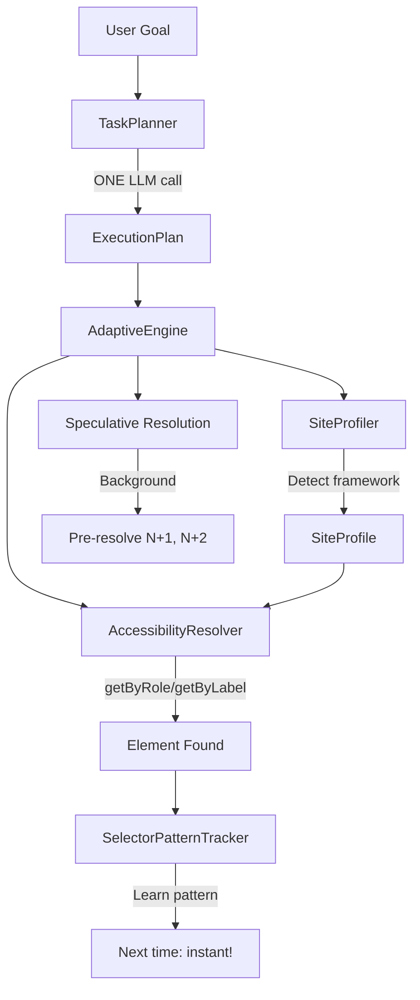

# LLM Web Agent

> An adaptive browser automation framework that uses LLM-first planning, accessibility-first resolution, and learning to achieve fast, robust web interactions.

[](https://github.com/suhaibbinyounis/llm-web-agent/actions/workflows/ci.yml)
[](https://www.python.org/downloads/)
[](https://opensource.org/licenses/MIT)


---

## 📖 Introduction & Philosophy

### The Problem: "Smart is Slow, Fast is Dumb"

In the current landscape of web automation, developers are forced to choose between two extremes:

1.  **Pure LLM Agents (e.g., Browser Use, MultiOn)**: 
    *   **Pros**: Highly intelligent, can handle dynamic sites.
    *   **Cons**: **Extremely slow & expensive**. They take a screenshot at *every single step*, send it to a vision model (GPT-4o/Claude 3.5), wait for token generation, and execute one action. A simple 10-step checkout can take 2 minutes and cost $0.50.
2.  **Traditional Scripts (Selenium/Playwright)**:
    *   **Pros**: Blazing fast, free to run.
    *   **Cons**: **Brittle**. A single CSS class change breaks the entire pipeline. They require constant maintenance.

### Why This Project Exists

We asked: **"Why can't we have the intelligence of an LLM agent with the speed of a traditional script?"**

Most existing "AI Agents" are simply naive loops of `Snapshot -> LLM -> Action`. They don't *learn*. If you run them 100 times, they burn the same tokens 100 times, making the same slow decisions.

**LLM Web Agent** is different. It is an **Adaptive Automation Framework** that treats the LLM as a *planner*, not a driver.

### How It Works: The "Plan, Execute, Learn" Cycle

1.  **Plan (One-Shot)**: Instead of asking the LLM "what do I do next?" 20 times, we send the *entire* goal. The LLM returns a high-level plan (e.g., "Login, Search, Add to Cart").
2.  **Execute (Accessibility-First)**: We use the **Accessibility Tree** (Role, Label, TestID) to find elements. This is how screen readers see the web, and it's remarkably stable compared to CSS selectors.
3.  **Learn (The "Aha!" Moment)**: When the agent finds the "Login" button using a complex heuristic, it **memorizes** the efficient selector for that site.
4.  **Optimize**: On the next run, it skips the expensive search and uses the cached, verified selector instantly.

**Result**: The first run might take 10 seconds. The second run takes 2 seconds.

### Our Vision

We are building the **standard runtime for AI web agents**. Open source, accessible, and designed for reliability. We believe that for AI agents to be practical, they must be indistinguishable from native code in speed and reliability.

This project is **Open Source** work in progress. Join us in building the fastest web agent on the planet.

---

## 🎯 Key Features

### 1. Robust Interaction & Navigation Engine (2025 Update)

Engineered for reliability in complex, dynamic web environments using advanced browser context management:

- **Context-Aware Navigation**:
  - **Auto-Switching**: Implements a `PlaywrightContext` listener that tracks the `page.context.pages` array. When a new tab/popup exceeds the previous page count after an action, execution `ctx` automatically pivots to the newest `IPage` handle.
  - **State Persistence**: Uses a shared `RunContext` object injected into the execution pipeline, allowing transient state (like `_last_hover_selector`) to persist across distinct `engine.run()` boundaries—critical for hover-dependent interactions (e.g., MUI menus).

- **Adaptive Click Strategies**:
  - **Visibility Assurance**: Pre-computes `element.scrollIntoView({behavior: "smooth", block: "center"})` before every click action to eliminate "click intercepted" exceptions caused by sticky headers or overlays.
  - **Multi-Layer Validation**: Uses a hierarchical execution strategy:
    1.  **Standard Click**: Playwright-native trust event.
    2.  **Force Click**: Bypasses actionability checks if standard fails.
    3.  **JS Injection**: Direct generic `HTMLElement.click()` via `page.evaluate()` as a fail-safe.
  - **Smart Deduplication**: Monitors `page.url` and `browser.contexts` during click strategies. logical branches immediately abort retries if a navigation event or new tab is detected, designed to prevent duplicate form submissions or multi-tab spam.

- **Enhanced Instruction Processing**:
  - **Dynamic Normalization**: Replaced rigid keyword matching with a flexible regex/LLM hybrid parser that supports generic field identifiers (`[\w][\w-]*`) and non-standard actions like "Hover", reducing token usage by normalizing complex NL instructions into standardized intermediate representation (IR) locally when possible.

### 2. Adaptive Intelligence Engine

Treats browser automation as a search and optimization problem:

- **LLM-First Planning**: Instead of iterative agents, we use a single "Planner" call that generates a structured JSON execution plan. This decouples reasoning (LLM) from execution (Python), allowing logical checks on the plan before a single browser action is taken.
- **Pattern Learning System**:
  - **Mechanism**: The `SelectorPatternTracker` maintains a persistent `sqlite3` or in-memory map of `(domain, semantic_intent) -> successful_selector`.
  - **Outcome**: If `Sign In` was successfully clicked via `data-testid="login_v2"` on run #1, run #2 bypasses search algorithms and attempts the cached selector immediately (O(1) resolution).
- **Framework Detection**: The `SiteProfiler` injects heuristics to detect JS frameworks (e.g., scanning for `_reactRootContainer` or `ng-version`). It dynamically re-weights the `AccessibilityResolver` strategies (e.g., favoring `data-test` attributes for React apps vs `aria-label` for standard HTML).

### 3. Real-Time Performance Architecture

Maximizes throughput by eliminating HTTP overhead:

- **WebSocket Integration**: Implements a persistent bidirectional connection using `websockets` library interacting with the `/v1/realtime` endpoint. This drops the per-request latency from ~500ms (HTTP handshake + headers) to ~50ms (packet overhead), critical for "chat-with-browser" experiences.
- **Speculative Pre-Resolution**:
  - **Pipeline**: While Step N computes an action (e.g., waiting for navigation), an asynchronous background task (`asyncio.create_task`) queries the LLM/DOM for Step N+1 and N+2.
  - **Cache**: Locators are stored in a `Future`-based cache. When execution reaches Step N+1, the selector is often already resolved, resulting in near-zero user perception of "thinking time".

### 4. Enterprise-Grade Observability

- **Comprehensive Reporting**: The execution engine streams events to a structural logger that builds a DAG of the session. This is exported as:
  - **HTML**: Interactive timeline of steps with screenshots.
  - **JSON**: Machine-readable traces for CI/CD pipelines.
- **Visual Debugging**: Uses `page.screenshot(full_page=False)` strategically before and after critical actions (clicks, navigation) and on `Exception` blocks, creating a visual frame-by-frame replay of failures.
- **Traceability**: Every log line includes a session UUID and step ID, matching the `task.md` and report artifacts for auditability.


---


## 🏗️ Architecture



### Core Components

| Component | File | Purpose |
|-----------|------|---------|
| **TaskPlanner** | `task_planner.py` | LLM-first planning with multiple locators |
| **SiteProfiler** | `site_profiler.py` | Framework detection + selector learning |
| **AccessibilityResolver** | `accessibility_resolver.py` | Playwright a11y-based resolution |
| **SelectorPatternTracker** | `selector_pattern_tracker.py` | Pattern-based learning |
| **AdaptiveEngine** | `adaptive_engine.py` | Orchestrator with speculative execution |

---

## 📊 Performance

### Real-World Test: SauceDemo Checkout

| Metric | Value |
|--------|-------|
| **Steps Completed** | 13/13 (100%) |
| **Total Duration** | 59.12s |
| **LLM Calls** | 1 (planning only) |
| **Avg Step Time** | 4.5s (including waits) |
| **Framework Detected** | React |

### Step-by-Step Breakdown

| Step | Action | Locator Used | Time |
|------|--------|--------------|------|
| 1 | Fill username | CSS | 42ms |
| 2 | Fill password | CSS | 29ms |
| 3 | Click Login | text | 64ms |
| 4 | Wait for products | - | 7ms |
| 5 | Click Backpack | text | 46ms |
| 6 | Add to cart | text | 35ms |
| 7 | Click cart icon | CSS | 64ms |
| 8 | Click Checkout | CSS | 55ms |
| 9-11 | Fill checkout form | CSS | 18ms |
| 12 | Click Continue | CSS | 57ms |
| 13 | Click Finish | CSS | 52ms |

---

## 🚀 Quick Start

### Installation

```bash
git clone https://github.com/suhaibbinyounis/llm-web-agent.git
cd llm-web-agent
python3 -m venv .venv
source .venv/bin/activate
pip install -e ".[all]"
playwright install chromium
```

### Usage Guide

#### 1. Adaptive Execution (Goal-Based)
Best for general tasks. The agent plans and executes steps automatically using the new Intelligence Engine.

```bash
# Basic run
llm-web-agent run-adaptive "Login to saucedemo.com as standard_user"

# Run with visible browser (useful for debugging)
llm-web-agent run-adaptive "search for cats on google" --visible

# Run with Low-Latency WebSocket connection
llm-web-agent run-adaptive "navigate to example.com" --websocket
```

#### 2. Instruction Files (Script-Based)
Execute a pre-defined list of instructions from a text file, line by line.

```bash
# Execute a script file
llm-web-agent run-file instructions/user_flow.txt

# Execute with report generation
llm-web-agent run-file instructions/checkout.txt --report --report-dir ./my-reports
```

#### 3. Single Instruction (Legacy)
Execute a single atomic instruction.

```bash
llm-web-agent run "go to google.com"
```

#### 4. GUI Web Interface (New!)

Launch a browser-based control panel for visual task execution and monitoring.

```bash
# Launch the GUI
llm-web-agent gui

# Open http://127.0.0.1:8000 in your browser
```

**GUI Features:**
- **Dual Execution Modes**: 
  - **Instructions Mode** - Step-by-step commands (like `run-file`)
  - **Goal Mode** - High-level objectives (like `run-adaptive`)
- **Live Browser Preview** - Watch the agent interact with pages in real-time
- **Step-by-Step Execution Log** - Track progress with status indicators
- **Persistent Settings** - Saved to `~/.llm-web-agent/gui_settings.json`
- **Configurable Options** - Connection, Browser, Execution, and Report settings

### CLI Reference

| Command | Argument | Description |
|---------|----------|-------------|
| `run-adaptive` | `GOAL` | **Recommended**. Plans and executes a high-level goal using the Adaptive Engine. |
| `run-file` | `FILE` | Executes a newline-separated file of instructions sequence. |
| `run` | `INSTRUCTION` | Executes a single raw instruction (Legacy). |
| `gui` | - | **New!** Launch the web-based GUI at `http://127.0.0.1:8000`. |
| `health` | - | Checks connection to the configured LLM provider. |
| `version` | - | Displays current version. |

#### Common Options

| Flag | Short | Description |
|------|-------|-------------|
| `--visible` | `-v` | Run browser in headful mode (visible window). |
| `--browser` | `-b` | Browser channel: `chromium` (default), `chrome`, `msedge`. |
| `--websocket` | `--ws` | **High Performance**: Use persistent WebSocket connection for LLM. |
| `--report` | `-r` | Generate HTML/JSON execution reports with screenshots. |
| `--report-dir` | - | Directory to save reports (default: `./reports`). |
| `--report-formats` | - | Comma-separated formats: `json,md,html` (default: all). |
| `--model` | `-m` | LLM model name (default: `gpt-4.1`). |
| `--api-url` | - | Custom API Base URL (default: `http://127.0.0.1:3030`). | 
| `--verbose` |  | Enable debug logging. |

### Python API (New AdaptiveEngine)

```python
import asyncio
from playwright.async_api import async_playwright
from llm_web_agent.engine import AdaptiveEngine
from llm_web_agent.llm.openai_provider import OpenAIProvider

async def main():
    llm = OpenAIProvider()
    engine = AdaptiveEngine(llm_provider=llm)
    
    async with async_playwright() as p:
        browser = await p.chromium.launch(headless=False)
        page = await browser.new_page()
        await page.goto("https://www.saucedemo.com")
        
        result = await engine.run(page, """
            1. Enter username "standard_user"
            2. Enter password "secret_sauce"
            3. Click the Login button
            4. Click on "Sauce Labs Backpack"
            5. Add to cart
            6. Complete checkout with John Doe, 12345
        """)
        
        print(f"Success: {result.success}")
        print(f"Steps: {result.steps_completed}/{result.steps_total}")
        print(f"Duration: {result.duration_seconds:.1f}s")

asyncio.run(main())
```

---

## ⚙️ Configuration

### Environment Variables

```bash
# LLM Provider
OPENAI_API_KEY=sk-your-key-here
# Or use GitHub Copilot API Gateway
COPILOT_API_URL=http://localhost:5100

# Browser settings
LLM_WEB_AGENT__BROWSER__HEADLESS=true
```

### Supported LLM Providers

| Provider | Configuration |
|----------|--------------|
| OpenAI | `OPENAI_API_KEY` |
| Anthropic | `ANTHROPIC_API_KEY` |
| GitHub Copilot | Via [github-copilot-api-vscode](https://github.com/suhaibbinyounis/github-copilot-api-vscode) |
| Local LLMs | Any OpenAI-compatible endpoint |

---

## 🔬 Research Context

### The Problem with Current Approaches

| Approach | Speed | Robustness | Cost |
|----------|-------|------------|------|
| **Pure LLM Agents** | Slow (5-20s/action) | High | $$$ |
| **Traditional Automation** | Fast | Low (brittle) | $ |
| **Vision AI** | Medium | Medium | $$ |
| **Our Adaptive Engine** | **Fast** | **High** | **$** |

### Our Solution

1. **LLM-first planning**: ONE call plans complete task
2. **Accessibility-first resolution**: Framework-agnostic, stable locators
3. **Learning system**: Remembers what works per-site
4. **Speculative execution**: Pre-resolves future steps

---

## 📚 Project Structure

```
src/llm_web_agent/
├── engine/                    # Core execution engine
│   ├── adaptive_engine.py         # NEW: Main orchestrator with learning
│   ├── task_planner.py            # NEW: LLM-first task planning
│   ├── site_profiler.py           # NEW: Framework detection
│   ├── accessibility_resolver.py  # NEW: Playwright a11y resolution
│   ├── selector_pattern_tracker.py # NEW: Pattern learning
│   ├── engine.py                  # Legacy engine
│   ├── target_resolver.py         # Legacy resolution cascade
│   └── dom_map.py                 # Real-time DOM registry
├── browsers/         # Browser adapters
├── llm/              # LLM provider integrations
├── actions/          # Action implementations
└── cli/              # Command-line interface
```

---

## 🛠️ Development

```bash
pip install -e ".[dev]"
pytest tests/ -v
ruff check .
ruff format .
```

---

## 📖 Citation

```bibtex
@software{llm_web_agent,
  author = {Suhaib Bin Younis},
  title = {LLM Web Agent: Adaptive Browser Automation with Learning},
  year = {2025},
  url = {https://github.com/suhaibbinyounis/llm-web-agent}
}
```

---

## 📝 License

MIT License - see [LICENSE](LICENSE) for details.

---

## 🤝 Contributing

Contributions welcome! See [CONTRIBUTING.md](CONTRIBUTING.md) for guidelines.

---

<p align="center">
  <sub>Built with ❤️ for the future of AI-driven web automation</sub>
</p>
