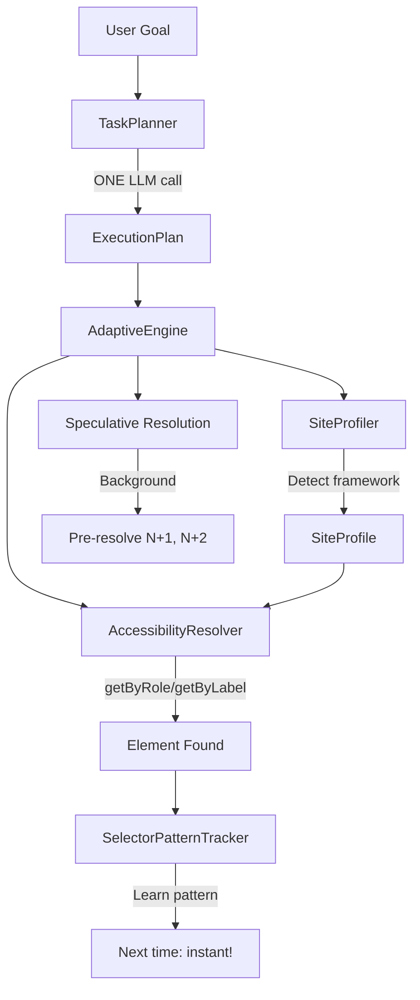

# LLM Web Agent

> An adaptive browser automation framework that uses LLM-first planning, accessibility-first resolution, and learning to achieve fast, robust web interactions.

[](https://github.com/suhaibbinyounis/llm-web-agent/actions/workflows/ci.yml)
[](https://www.python.org/downloads/)
[](https://opensource.org/licenses/MIT)

---

## 🎯 Key Features

### 1. Robust Interaction & Navigation Engine (2025 Update)

Engineered for reliability in complex, dynamic web environments:

- **Context-Aware Navigation**:
  - **Auto-Switching**: Intelligent detection of new tabs and windows, automatically shifting execution context to the active view.
  - **State Persistence**: Shared execution context across instruction steps ensures transient states (like hover menus) are preserved.

- **Adaptive Click Strategies**:
  - **Visibility Assurance**: Automatic `scrollIntoView` pre-computation to eliminate "click intercepted" failures.
  - **Multi-Layer Validation**: Hierarchical execution strategy (Standard → Force → JavaScript Injection) with DOM mutation verification.
  - **Smart Deduplication**: Instant detection of navigation events or new tab openings to prevent redundant actions.

- **Enhanced Instruction Processing**:
  - **Dynamic Normalization**: Improved parser supports generic field matching and hover interactions without hardcoded constraints.
  - **One-Shot Planning**: Optimized token usage by normalizing complex instruction sets in a single LLM pass.

### 2. Adaptive Intelligence Engine

- **LLM-First Planning**: One single LLM call plans the entire task execution strategy, generating a multi-step optimized plan.
- **Pattern Learning System**: Automatically memorizes successful selector patterns per-site (e.g., "Login button" → `data-testid="login"`), drastically reducing resolution time on subsequent visits.
- **Framework Detection**: Profiler identifies underlying frameworks (React, Vue, Angular) to prioritize framework-specific resolution strategies.

### 3. Real-Time Performance Architecture

- **WebSocket Integration**: Native support for persistent low-latency WebSocket connections (`/v1/realtime`), eliminating HTTP handshake overhead for high-frequency interactions.
- **Speculative Pre-Resolution**: Background processes resolve future steps (N+1, N+2) while the current step executes, creating a zero-latency "pipeline" effect.

### 4. Enterprise-Grade Observability

- **Comprehensive Reporting**: Generates detailed execution artifacts including HTML visual reports, JSON data dumps, and Markdown summaries.
- **Visual Debugging**: Capture screenshots before/after every step and on error states for rapid root cause analysis.
- **Traceability**: Full execution logs with timing metrics for performance optimization.


---


## 🏗️ Architecture



### Core Components

| Component | File | Purpose |
|-----------|------|---------|
| **TaskPlanner** | `task_planner.py` | LLM-first planning with multiple locators |
| **SiteProfiler** | `site_profiler.py` | Framework detection + selector learning |
| **AccessibilityResolver** | `accessibility_resolver.py` | Playwright a11y-based resolution |
| **SelectorPatternTracker** | `selector_pattern_tracker.py` | Pattern-based learning |
| **AdaptiveEngine** | `adaptive_engine.py` | Orchestrator with speculative execution |

---

## 📊 Performance

### Real-World Test: SauceDemo Checkout

| Metric | Value |
|--------|-------|
| **Steps Completed** | 13/13 (100%) |
| **Total Duration** | 59.12s |
| **LLM Calls** | 1 (planning only) |
| **Avg Step Time** | 4.5s (including waits) |
| **Framework Detected** | React |

### Step-by-Step Breakdown

| Step | Action | Locator Used | Time |
|------|--------|--------------|------|
| 1 | Fill username | CSS | 42ms |
| 2 | Fill password | CSS | 29ms |
| 3 | Click Login | text | 64ms |
| 4 | Wait for products | - | 7ms |
| 5 | Click Backpack | text | 46ms |
| 6 | Add to cart | text | 35ms |
| 7 | Click cart icon | CSS | 64ms |
| 8 | Click Checkout | CSS | 55ms |
| 9-11 | Fill checkout form | CSS | 18ms |
| 12 | Click Continue | CSS | 57ms |
| 13 | Click Finish | CSS | 52ms |

---

## 🚀 Quick Start

### Installation

```bash
git clone https://github.com/suhaibbinyounis/llm-web-agent.git
cd llm-web-agent
python3 -m venv .venv
source .venv/bin/activate
pip install -e ".[all]"
playwright install chromium
```

### Usage Guide

#### 1. Adaptive Execution (Goal-Based)
Best for general tasks. The agent plans and executes steps automatically.

```bash
# Basic run
llm-web-agent run-adaptive "Login to saucedemo.com as standard_user"

# Run with visible browser (useful for debugging)
llm-web-agent run-adaptive "search for cats on google" --visible

# Run with Low-Latency WebSocket connection
llm-web-agent run-adaptive "navigate to example.com" --websocket
```

#### 2. Instruction Files (Script-Based)
Execute a pre-defined list of instructions from a text file.

```bash
# Execute a script file
llm-web-agent run-file instructions/user_flow.txt

# Execute with report generation
llm-web-agent run-file instructions/checkout.txt --report --report-dir ./my-reports
```

#### 3. Low-Latency WebSocket Support ⚡️
Reduce LLM interaction latency by using a persistent WebSocket connection.

```bash
# Use the --websocket (or --ws) flag
llm-web-agent run-adaptive "Find cheap flights" --websocket
```
*Note: Requires an LLM provider that supports the `/v1/realtime` endpoint (e.g., Copilot Gateway).*

#### 4. Advanced Options

| Flag | Description |
|------|-------------|
| `--visible` / `-v` | Run browser in headful mode (visible) |
| `--websocket` / `--ws` | Use persistent WebSocket connection |
| `--report` / `-r` | Generate detailed execution report (HTML/JSON/MD) |
| `--model` | Specify LLM model (default: gpt-4.1) |
| `--api-url` | Custom LLM API URL |

### Python API (New AdaptiveEngine)

```python
import asyncio
from playwright.async_api import async_playwright
from llm_web_agent.engine import AdaptiveEngine
from llm_web_agent.llm.openai_provider import OpenAIProvider

async def main():
    llm = OpenAIProvider()
    engine = AdaptiveEngine(llm_provider=llm)
    
    async with async_playwright() as p:
        browser = await p.chromium.launch(headless=False)
        page = await browser.new_page()
        await page.goto("https://www.saucedemo.com")
        
        result = await engine.run(page, """
            1. Enter username "standard_user"
            2. Enter password "secret_sauce"
            3. Click the Login button
            4. Click on "Sauce Labs Backpack"
            5. Add to cart
            6. Complete checkout with John Doe, 12345
        """)
        
        print(f"Success: {result.success}")
        print(f"Steps: {result.steps_completed}/{result.steps_total}")
        print(f"Duration: {result.duration_seconds:.1f}s")

asyncio.run(main())
```

---

## ⚙️ Configuration

### Environment Variables

```bash
# LLM Provider
OPENAI_API_KEY=sk-your-key-here
# Or use GitHub Copilot API Gateway
COPILOT_API_URL=http://localhost:5100

# Browser settings
LLM_WEB_AGENT__BROWSER__HEADLESS=true
```

### Supported LLM Providers

| Provider | Configuration |
|----------|--------------|
| OpenAI | `OPENAI_API_KEY` |
| Anthropic | `ANTHROPIC_API_KEY` |
| GitHub Copilot | Via [github-copilot-api-vscode](https://github.com/suhaibbinyounis/github-copilot-api-vscode) |
| Local LLMs | Any OpenAI-compatible endpoint |

---

## 🔬 Research Context

### The Problem with Current Approaches

| Approach | Speed | Robustness | Cost |
|----------|-------|------------|------|
| **Pure LLM Agents** | Slow (5-20s/action) | High | $$$ |
| **Traditional Automation** | Fast | Low (brittle) | $ |
| **Vision AI** | Medium | Medium | $$ |
| **Our Adaptive Engine** | **Fast** | **High** | **$** |

### Our Solution

1. **LLM-first planning**: ONE call plans complete task
2. **Accessibility-first resolution**: Framework-agnostic, stable locators
3. **Learning system**: Remembers what works per-site
4. **Speculative execution**: Pre-resolves future steps

---

## 📚 Project Structure

```
src/llm_web_agent/
├── engine/                    # Core execution engine
│   ├── adaptive_engine.py         # NEW: Main orchestrator with learning
│   ├── task_planner.py            # NEW: LLM-first task planning
│   ├── site_profiler.py           # NEW: Framework detection
│   ├── accessibility_resolver.py  # NEW: Playwright a11y resolution
│   ├── selector_pattern_tracker.py # NEW: Pattern learning
│   ├── engine.py                  # Legacy engine
│   ├── target_resolver.py         # Legacy resolution cascade
│   └── dom_map.py                 # Real-time DOM registry
├── browsers/         # Browser adapters
├── llm/              # LLM provider integrations
├── actions/          # Action implementations
└── cli/              # Command-line interface
```

---

## 🛠️ Development

```bash
pip install -e ".[dev]"
pytest tests/ -v
ruff check .
ruff format .
```

---

## 📖 Citation

```bibtex
@software{llm_web_agent,
  author = {Suhaib Bin Younis},
  title = {LLM Web Agent: Adaptive Browser Automation with Learning},
  year = {2025},
  url = {https://github.com/suhaibbinyounis/llm-web-agent}
}
```

---

## 📝 License

MIT License - see [LICENSE](LICENSE) for details.

---

## 🤝 Contributing

Contributions welcome! See [CONTRIBUTING.md](CONTRIBUTING.md) for guidelines.

---

<p align="center">
  <sub>Built with ❤️ for the future of AI-driven web automation</sub>
</p>
