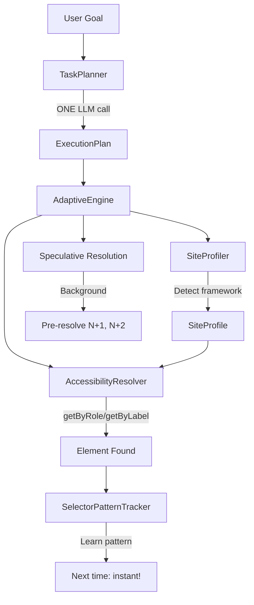

# LLM Web Agent

> An adaptive browser automation framework that uses LLM-first planning, accessibility-first resolution, and learning to achieve fast, robust web interactions.

[](https://github.com/suhaibbinyounis/llm-web-agent/actions/workflows/ci.yml)
[](https://www.python.org/downloads/)
[](https://opensource.org/licenses/MIT)

---

## 🎯 Key Features

### 1. LLM-First Planning (NEW!)

**One LLM call plans your entire task** with multiple locator strategies per step:

```python
from llm_web_agent.engine import AdaptiveEngine

engine = AdaptiveEngine(llm_provider=llm)
result = await engine.run(page, """
    1. Enter username "standard_user"
    2. Enter password "secret_sauce"
    3. Click Login
    4. Add "Sauce Labs Backpack" to cart
    5. Complete checkout
""")
# Result: 13/13 steps completed in ~59 seconds
```

### 2. Accessibility-First Resolution

Inspired by [Playwright MCP](https://github.com/microsoft/playwright-mcp), we prioritize **accessibility tree** methods for stable element finding:

| Priority | Method | Stability | Example |
|----------|--------|-----------|---------|
| 1 | `getByTestId()` | ⭐⭐⭐⭐⭐ | `data-testid="login-btn"` |
| 2 | `getByRole()` | ⭐⭐⭐⭐ | `button` with name "Login" |
| 3 | `getByLabel()` | ⭐⭐⭐⭐ | Form label association |
| 4 | `getByText()` | ⭐⭐⭐ | Visible text content |
| 5 | CSS Selector | ⭐⭐ | Fallback only |

**Why it works**: Playwright's accessibility methods use the a11y tree, making them framework-agnostic (React, Angular, Vue all produce the same tree).

### 3. Site Profiling & Framework Detection

Automatically detects framework and learns optimal selectors:

```python
# Detects: React, Angular, Vue, Next.js, Nuxt, Svelte
# Learns: Which selector types work on each site
# Adapts: Reorders strategies based on success rate

profile = await profiler.get_profile(page)
# SiteProfile(framework='react', priorities=['testid', 'role', 'text'], ...)
```

### 4. Pattern Learning

**Remembers what works** for instant resolution next time:

```
First time: "Login button" → tries 3 strategies → testid works ✓
Next time:  "Signup button" → uses testid pattern FIRST → instant match!
```

### 5. Speculative Pre-Resolution

Resolves steps N+1 and N+2 in the background while current step executes:

```
Executing Step 1... │ Background: Pre-resolving Step 2, 3
Executing Step 2... │ Background: Pre-resolving Step 3, 4 (already cached!)
```

---

## 🏗️ Architecture



### Core Components

| Component | File | Purpose |
|-----------|------|---------|
| **TaskPlanner** | `task_planner.py` | LLM-first planning with multiple locators |
| **SiteProfiler** | `site_profiler.py` | Framework detection + selector learning |
| **AccessibilityResolver** | `accessibility_resolver.py` | Playwright a11y-based resolution |
| **SelectorPatternTracker** | `selector_pattern_tracker.py` | Pattern-based learning |
| **AdaptiveEngine** | `adaptive_engine.py` | Orchestrator with speculative execution |

---

## 📊 Performance

### Real-World Test: SauceDemo Checkout

| Metric | Value |
|--------|-------|
| **Steps Completed** | 13/13 (100%) |
| **Total Duration** | 59.12s |
| **LLM Calls** | 1 (planning only) |
| **Avg Step Time** | 4.5s (including waits) |
| **Framework Detected** | React |

### Step-by-Step Breakdown

| Step | Action | Locator Used | Time |
|------|--------|--------------|------|
| 1 | Fill username | CSS | 42ms |
| 2 | Fill password | CSS | 29ms |
| 3 | Click Login | text | 64ms |
| 4 | Wait for products | - | 7ms |
| 5 | Click Backpack | text | 46ms |
| 6 | Add to cart | text | 35ms |
| 7 | Click cart icon | CSS | 64ms |
| 8 | Click Checkout | CSS | 55ms |
| 9-11 | Fill checkout form | CSS | 18ms |
| 12 | Click Continue | CSS | 57ms |
| 13 | Click Finish | CSS | 52ms |

---

## 🚀 Quick Start

### Installation

```bash
git clone https://github.com/suhaibbinyounis/llm-web-agent.git
cd llm-web-agent
python3 -m venv .venv
source .venv/bin/activate
pip install -e ".[all]"
playwright install chromium
```

### Basic Usage

```bash
# Run with natural language instruction
llm-web-agent run "go to google.com, search for Python tutorials"

# Run with visible browser
llm-web-agent run "go to github.com, click Sign in" --visible
```

### Python API (New AdaptiveEngine)

```python
import asyncio
from playwright.async_api import async_playwright
from llm_web_agent.engine import AdaptiveEngine
from llm_web_agent.llm.openai_provider import OpenAIProvider

async def main():
    llm = OpenAIProvider()
    engine = AdaptiveEngine(llm_provider=llm)
    
    async with async_playwright() as p:
        browser = await p.chromium.launch(headless=False)
        page = await browser.new_page()
        await page.goto("https://www.saucedemo.com")
        
        result = await engine.run(page, """
            1. Enter username "standard_user"
            2. Enter password "secret_sauce"
            3. Click the Login button
            4. Click on "Sauce Labs Backpack"
            5. Add to cart
            6. Complete checkout with John Doe, 12345
        """)
        
        print(f"Success: {result.success}")
        print(f"Steps: {result.steps_completed}/{result.steps_total}")
        print(f"Duration: {result.duration_seconds:.1f}s")

asyncio.run(main())
```

---

## ⚙️ Configuration

### Environment Variables

```bash
# LLM Provider
OPENAI_API_KEY=sk-your-key-here
# Or use GitHub Copilot API Gateway
COPILOT_API_URL=http://localhost:5100

# Browser settings
LLM_WEB_AGENT__BROWSER__HEADLESS=true
```

### Supported LLM Providers

| Provider | Configuration |
|----------|--------------|
| OpenAI | `OPENAI_API_KEY` |
| Anthropic | `ANTHROPIC_API_KEY` |
| GitHub Copilot | Via [github-copilot-api-vscode](https://github.com/suhaibbinyounis/github-copilot-api-vscode) |
| Local LLMs | Any OpenAI-compatible endpoint |

---

## 🔬 Research Context

### The Problem with Current Approaches

| Approach | Speed | Robustness | Cost |
|----------|-------|------------|------|
| **Pure LLM Agents** | Slow (5-20s/action) | High | $$$ |
| **Traditional Automation** | Fast | Low (brittle) | $ |
| **Vision AI** | Medium | Medium | $$ |
| **Our Adaptive Engine** | **Fast** | **High** | **$** |

### Our Solution

1. **LLM-first planning**: ONE call plans complete task
2. **Accessibility-first resolution**: Framework-agnostic, stable locators
3. **Learning system**: Remembers what works per-site
4. **Speculative execution**: Pre-resolves future steps

---

## 📚 Project Structure

```
src/llm_web_agent/
├── engine/                    # Core execution engine
│   ├── adaptive_engine.py         # NEW: Main orchestrator with learning
│   ├── task_planner.py            # NEW: LLM-first task planning
│   ├── site_profiler.py           # NEW: Framework detection
│   ├── accessibility_resolver.py  # NEW: Playwright a11y resolution
│   ├── selector_pattern_tracker.py # NEW: Pattern learning
│   ├── engine.py                  # Legacy engine
│   ├── target_resolver.py         # Legacy resolution cascade
│   └── dom_map.py                 # Real-time DOM registry
├── browsers/         # Browser adapters
├── llm/              # LLM provider integrations
├── actions/          # Action implementations
└── cli/              # Command-line interface
```

---

## 🛠️ Development

```bash
pip install -e ".[dev]"
pytest tests/ -v
ruff check .
ruff format .
```

---

## 📖 Citation

```bibtex
@software{llm_web_agent,
  author = {Suhaib Bin Younis},
  title = {LLM Web Agent: Adaptive Browser Automation with Learning},
  year = {2024},
  url = {https://github.com/suhaibbinyounis/llm-web-agent}
}
```

---

## 📝 License

MIT License - see [LICENSE](LICENSE) for details.

---

## 🤝 Contributing

Contributions welcome! See [CONTRIBUTING.md](CONTRIBUTING.md) for guidelines.

---

<p align="center">
  <sub>Built with ❤️ for the future of AI-driven web automation</sub>
</p>
